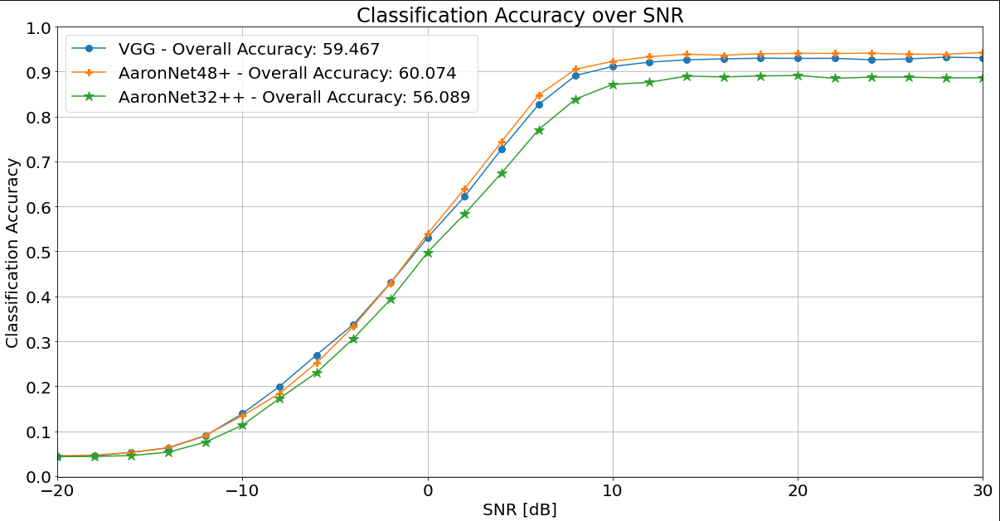
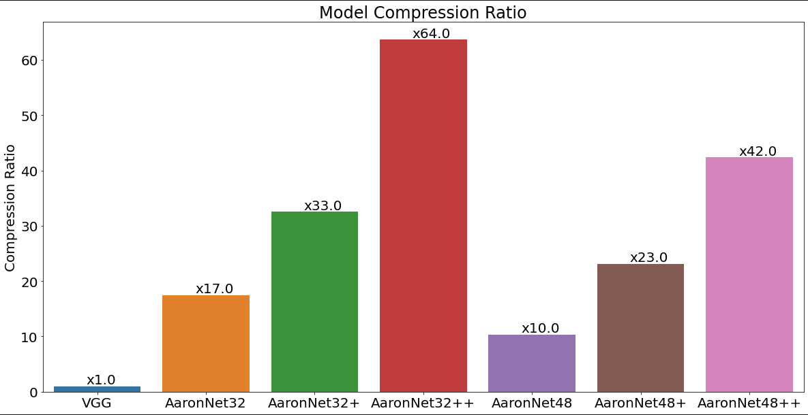
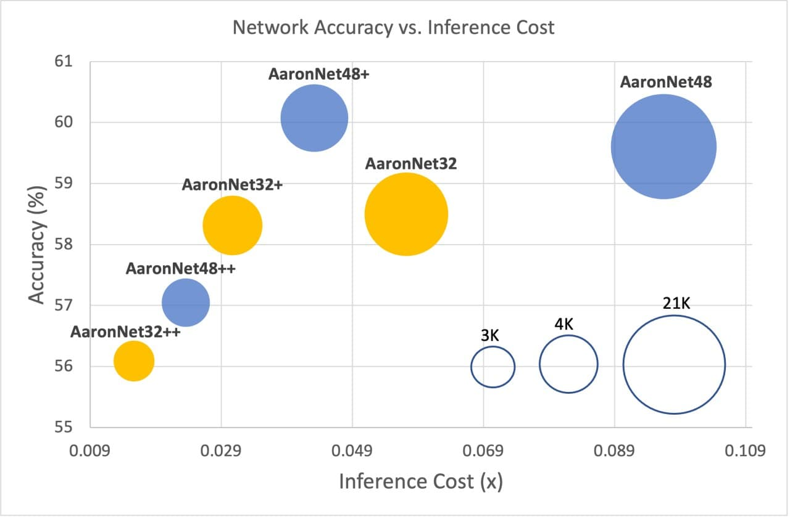
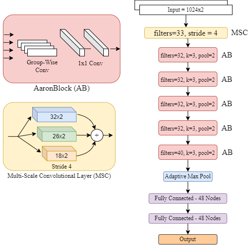

# AaronNet for ITU-ML5G-PS-007

## Table Of Contents

- [AaronNet for ITU-ML5G-PS-007](#aaronnet-for-itu-ml5g-ps-007)
  - [Table Of Contents](#table-of-contents)
  - [Variations](#variations)
  - [Metrics](#metrics)
  - [Evaluation](#evaluation)
  - [Results](#results)
  - [Architecture](#architecture)
  - [Usage:](#usage)
  - [Team Aaronica](#team-aaronica)
  - [Problem Statement](#problem-statement)
    - [Inference Cost](#inference-cost)

## Variations

Variation in number of filters:

- We propose two different variations of AaronNet: <b>AaronNet32</b> and <b>AaronNet48</b>.
- Key difference is the <b>number of filters</b> used in each layer.

Variation in pruning:

- AaronNetxx+ is a slightly pruned AaronNet which has the <b>same or higher accuracy</b>
- AaronNetxx++ is a highly pruned AaronNet which is taken to its <b>limit</b>, while meeting minimum accuracy threshold of the competition.

## Metrics

We evaluate our models based on accuracy and [Inference Cost](#inference-cost) (lower is better)

1. VGG Baseline:

   - **Network Accuracy** `59.47%`
   - **Inference Cost** `1.0000`

2. AaronNet32:

   - **Network Accuracy** `58.49%`
   - **Inference Cost** `0.057224`

3. AaronNet+:

   - **Network Accuracy** `58.31%`
   - **Inference Cost** `0.030711`

4. AaronNet32++:

   - **Network Accuracy** `56.09%`
   - **Inference Cost** `0.015705`

5. AaronNet48:

   - **Network Accuracy** `59.61%`
   - **Inference Cost** `0.096463`

6. AaronNet48+:

   - **Network Accuracy** `60.07%`
   - **Inference Cost** `0.043207`

7. AaronNet48++:
   - **Network Accuracy** `57.05%`
   - **Inference Cost** `0.023599`

## Evaluation

Please use `evaluation.ipynb` to analyze the results of our experiments.

## Results

<br><br>

Accuracy vs SNR: <br>

<br><br>

Compression Ratio: <br>

<br><br>

Accuracy vs Cost: <br>

<br><br>

## Architecture

AaronNet has the following architecture:

<br><br>


## Usage:

1. Use `main.py` for training, pruning, and testing.
2. There are 7 checkpoints in the `checkpoints` folder:
   - `vgg.pth`: Baseline VGG Network
   - `AaronNet32.pth`: AaronNet32
   - `AaronNet32plus.pth`: AaronNet32+
   - `AaronNet32plusplus.pth`: AaronNet32++
   - `AaronNet48.pth`: AaronNet48
   - `AaronNet48plus.pth`: AaronNet48+
   - `AaronNet48plusplus.pth`: AaronNet48++
3. `config` is used to set the configuration of our proposed solution. You may change number of filters, quantization btis, etc.

python main.py --args
Argument List and help:

```shell
('--bsize', default=1024, help='Batch Size')
('--lr', default=0.01, help='Learning Rate')
('--eps', default=50, help='Number of Training Epochs')
('--t0', default=5, help='LRScheduler parameter')
('--ret_ep', default=2, help='Retrain Epochs After Pruning - Multiplier of T_0')
('--st_snr', default=3, help='Starting SNR for training')
('--dset_path', default='', help='Path to RADIOML2018 HDF5 file')
('--checkpoint', default='submission_unpruned.pth', help='Starting Checkpoint')
('--w_dec', default=0.0, help='Weight Decay. Set to 0 to disable.')
('--nbits', default=8, help='Number of Quantization bits')
('--prn_list', default=[], help='Percentages of Pruning each Iteration. If not set, you have to use fixed percentage (prn_per)')
('--prn_per', default=30, help='Fixed Pruning Percentage')
('--out_folder', default='result', help='Path to Save the Log File and Checkpoints.')
('--gpu_num', default=0, help='Select GPU. Set to -1 to run on CPU')
('--action', default=1, help='Set to 2 to Prune, Set to 1 to Train, Set to 0 to Test checkpoint.')
```

You can also see requirements for this repository in `requirements.txt`!

## Team Aaronica

- Mohammad Chegini: mohammad.chegini@hotmail.com
- Pouya Shiri: pouyashiri@uvic.ca
- Amirali Baniasadi: amiralib@uvic.ca

## Problem Statement

In this challenge, the participants will design neural networks with an awareness of both inference computation cost and accuracy to explore the landscape of compact models for RF modulation classification on the DeepSig RadioML 2018 dataset.

<b>Goal:</b> Use quantization, sparsity, custom topology design and other training techniques to design a neural network that achieves a certain minimum accuracy on the RadioML 2018.01A dataset. Submissions will be ranked according to the inference cost function we define, and the lowest inference cost will win. Check under the Evaluation criteria tab for details.

<b>Background:</b> The ever-growing demand for wireless data is driving a need for improved radio efficiency, of which a key component is improved spectral allocation via high quality spectrum sensing and adaptation. A key component for solutions such as Dynamic Spectrum Access (DSA) and Cognitive Radio (CR) is Automatic Modulation Classification (AMC , where the high-level goal is to monitor the RF spectrum and determine the different modulations being used. This information is subsequently used to reach transmission decisions that transmit information more efficiently. Prior works have successfully applied deep learning to AMC, demonstrating competitive recognition accuracy for a variety of modulations and SNR regimes.

To reap the benefits of AMC with deep learning in practice, an important challenge remains: modulation classification should be performed with low latency and high throughput to accurately reflect the current status of the transmissions. Inference with common deep neural networks can involve hundreds of millions of multiply-accumulate operations and many megabytes of parameters, which makes line-rate performance very challenging. A body of research [4, 5, 6] seeks to address these challenges applying quantization to weights and activations, pruning, novel topology design and pruning, which may be done in a co-designed fashion with hardware [7, 8] to provide the required system-level throughput. As this typically comes at the cost of some classification accuracy, multiple solutions offering different throughput at different levels of accuracy may be created.

### Inference Cost

- The **inference cost will be measured on the exported ONNX graph with input shape (1, 2, 1024) by using the official implementation**. The exported graph is static regardless of the values of the input tensor.
- The **official implementation for the inference cost function will be provided in the latest version of the feature/itu_competition_21 branch of the Xilinx/finn-base GitHub repository, with the inference_cost() function call in this file as the entry point**. The per-layer inference cost analysis functions can be found here.
- The organizers reserve the right to update the inference cost function implementation to fix bugs and provide improvements.
- If the inference cost function implementation and the explanation in this document disagree, the organizers will resolve this accordingly.
- The procedure in the Custom Operations section must be followed to account for the inference cost of any custom operations not currently supported by the latest inference cost function implementation.
- The custom ONNX export and inference cost measurement will be done as shown in the Jupyter notebook in the sandbox.
- The inference cost will **take into account the number of multiply-accumulate (MAC) operations and number of parameters for Conv, MatMul and Gemm ops assuming a naive/direct implementation** (e.g. no Winograd for convolutions).
- The **following layers are assumed to be zero-cost and will not be taken into account for the inference cost**:
  1. elementwise nonlinearities,
  2. pooling,
  3. reshape/transpose/concat,
  4. batch normalization,
  5. Mul/Div and Add/Sub for applying biases or quantization scaling factors.
     These layers are elementwise and/or otherwise have little impact on total cost of inference based on existing DNN topologies.
- The inference cost will **discount for parameter sparsity** by discounted*mac = mac * (num*nonzero_ops/num_total_ops) and discounted_mem = mem * (num_nonzero_params/num_total_params) for each layer. **Activation sparsity and any other form of dynamic sparsity is not taken into account**.
- The inference cost will account for precision as follows: bit*ops = discounted_mac * weight*bits * act_bits and bit_mem = discounted_mem \* weight_bits for each layer.
- For ranking, the inference cost will be converted to a score by normalizing against the inference cost of the provided baseline model as follows: score = 0.5*(bit_ops/baseline_bit_ops) + 0.5*(bit_mem/baseline_bit_mem). The scores will be ranked low-to-high (i.e. lower is better).
